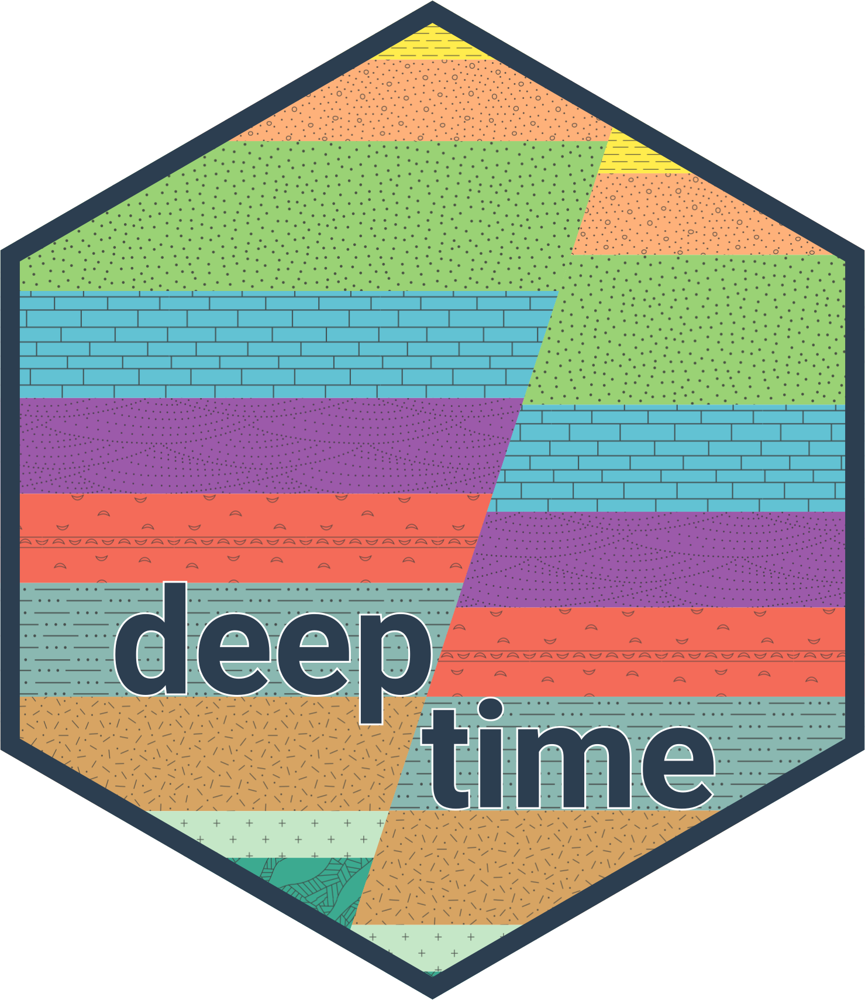
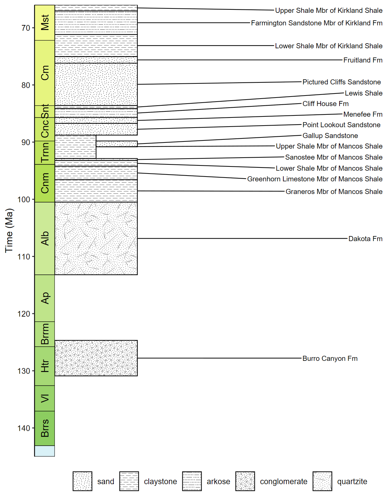

# deeptime 

<!-- badges: start -->
[](https://github.com/willgearty/deeptime/actions/workflows/R-CMD-check.yaml)
[](https://app.codecov.io/gh/willgearty/deeptime)
[](https://zenodo.org/badge/latestdoi/152502088)
[](https://CRAN.R-project.org/package=deeptime)
[](https://cran.r-project.org/package=deeptime)
<!-- badges: end -->

## Overview
__deeptime__ extends the functionality of other plotting packages (notably
`{ggplot2}`) to help facilitate the plotting of data over long time intervals,
including, but not limited to, geological, evolutionary, and ecological data.
The primary goal of __deeptime__ is to enable users to add highly customizable
timescales to their visualizations. Other functions are also included to assist
with other areas of deep time visualization.

## Installation
```r
# get the stable version from CRAN
install.packages("deeptime")

# or get the development version from github
# install.packages("devtools")
devtools::install_github("willgearty/deeptime")
```

## Usage

### Load packages
```r
library(deeptime)
library(ggplot2)
library(dplyr)
```

### Add one or more timescales to virtually any ggplot2 plot!

The main function of __deeptime__ is `coord_geo()`, which functions just like `coord_trans()` from `{ggplot2}`.
You can use this function to add highly customizable timescales to a wide variety of ggplots.

```r
library(divDyn)
data(corals)

# this is not a proper diversity curve but it gets the point across
coral_div <- corals %>% filter(stage != "") %>%
  group_by(stage) %>%
  summarise(n = n()) %>%
  mutate(stage_age = (stages$max_age[match(stage, stages$name)] +
                        stages$min_age[match(stage, stages$name)])/2)
ggplot(coral_div) +
  geom_line(aes(x = stage_age, y = n)) +
  scale_x_reverse("Age (Ma)") +
  ylab("Coral Genera") +
  coord_geo(xlim = c(250, 0), ylim = c(0, 1700)) +
  theme_classic(base_size = 16)
```


#### Lots of timescales available!

```r
# Load packages
library(gsloid)

# Plot two different timescales
ggplot(lisiecki2005) +
  geom_line(aes(x = d18O, y = Time / 1000), orientation = "y") +
  scale_y_reverse("Time (Ma)") +
  scale_x_reverse("\u03B418O") +
  coord_geo(
    dat = list("Geomagnetic Polarity Chron",
               "Planktic foraminiferal Primary Biozones"),
    xlim = c(6, 2), ylim = c(5.5, 0), pos = list("l", "r"),
    rot = 90, skip = "PL4", size = list(5, 4)
  ) +
  theme_classic(base_size = 16)
```


### Super flexible, supports multiple layouts, and works great with other packages!
```r
# Load packages
library(ggtree)
library(rphylopic)

# Get vertebrate phylogeny
library(phytools)
data(vertebrate.tree)

vertebrate.tree$tip.label[vertebrate.tree$tip.label ==
                            "Myotis_lucifugus"] <- "Vespertilioninae"
vertebrate_data <- data.frame(species = vertebrate.tree$tip.label,
                              name = vertebrate.tree$tip.label)

# Plot the phylogeny with a timescale
revts(ggtree(vertebrate.tree, size = 1)) %<+%
  vertebrate_data +
  geom_phylopic(aes(name = name), size = 25) +
  scale_x_continuous("Time (Ma)", breaks = seq(-500, 0, 100),
                     labels = seq(500, 0, -100), limits = c(-500, 0),
                     expand = expansion(mult = 0)) +
  scale_y_continuous(guide = NULL) +
  coord_geo_radial(dat = "periods", end = 0.5 * pi) +
  theme_classic(base_size = 16)
```


### Does lots of other things too!

#### Plot fossil occurence ranges
```r
library(palaeoverse)

# Filter occurrences
occdf <- subset(tetrapods, accepted_rank == "genus")
occdf <- subset(occdf, accepted_name %in%
                  c("Eryops", "Dimetrodon", "Diadectes", "Diictodon",
                    "Ophiacodon", "Diplocaulus", "Benthosuchus"))

# Plot occurrences
ggplot(data = occdf) +
  geom_points_range(aes(x = (max_ma + min_ma)/2, y = accepted_name)) +
  scale_x_reverse(name = "Time (Ma)") +
  ylab(NULL) +
  coord_geo(pos = list("bottom", "bottom"), dat = list("stages", "periods"),
            abbrv = list(TRUE, FALSE), expand = TRUE, size = "auto") +
  theme_classic(base_size = 16)
```


#### Use standardized geological patterns

```r
# Load packages
library(rmacrostrat)
library(ggrepel)

# Retrieve the Macrostrat units in the San Juan Basin column
san_juan_units <- get_units(column_id = 489, interval_name = "Cretaceous")

# Specify x_min and x_max in dataframe
san_juan_units$x_min <- 0
san_juan_units$x_max <- 1
# Tweak values for overlapping units
san_juan_units$x_max[10] <- 0.5
san_juan_units$x_min[11] <- 0.5

# Add midpoint age for plotting
san_juan_units$m_age <- (san_juan_units$b_age + san_juan_units$t_age) / 2

# Get lithology definitions
liths <- def_lithologies()

# Get the primary lithology for each unit
san_juan_units$lith_prim <- sapply(san_juan_units$lith, function(df) {
  df$name[which.max(df$prop)]
})

# Get the pattern codes for those lithologies
san_juan_units$pattern <- factor(liths$fill[match(san_juan_units$lith_prim, liths$name)])

# Plot with pattern fills
ggplot(san_juan_units, aes(ymin = b_age, ymax = t_age,
                           xmin = x_min, xmax = x_max)) +
  # Plot units, patterned by rock type
  geom_rect(aes(fill = pattern), color = "black") +
  scale_fill_geopattern(name = NULL,
                        breaks = factor(liths$fill), labels = liths$name) +
  # Add text labels
  geom_text_repel(aes(x = x_max, y = m_age, label = unit_name),
                  size = 3.5, hjust = 0, force = 2,
                  min.segment.length = 0, direction = "y",
                  nudge_x = rep_len(x = c(2, 3), length.out = 17)) +
  # Add geological time scale
  coord_geo(pos = "left", dat = list("stages"), rot = 90) +
  # Reverse direction of y-axis
  scale_y_reverse(limits = c(145, 66), n.breaks = 10, name = "Time (Ma)") +
  # Remove x-axis guide and title
  scale_x_continuous(NULL, guide = NULL) +
  # Choose theme and font size
  theme_classic(base_size = 14) +
  # Make tick labels black
  theme(legend.position = "bottom", legend.key.size = unit(1, 'cm'),
        axis.text.y = element_text(color = "black"))
```


