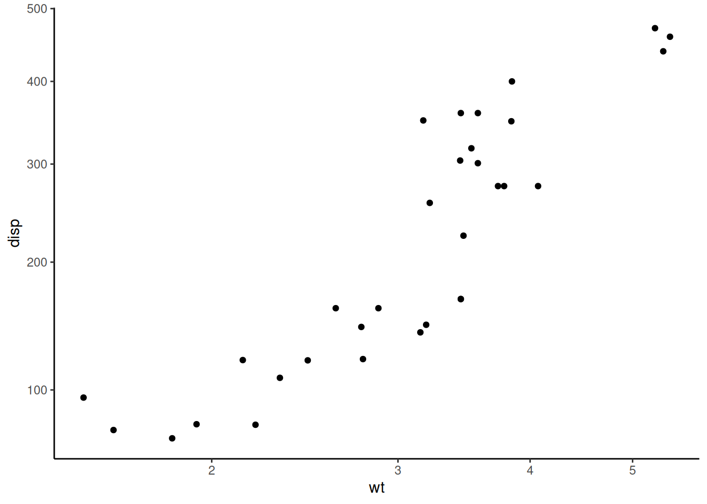
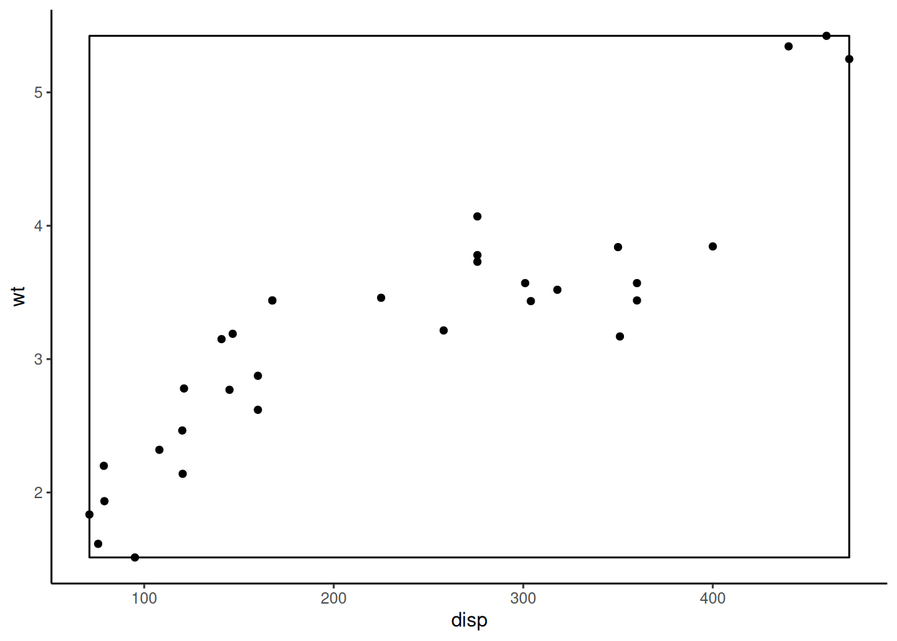
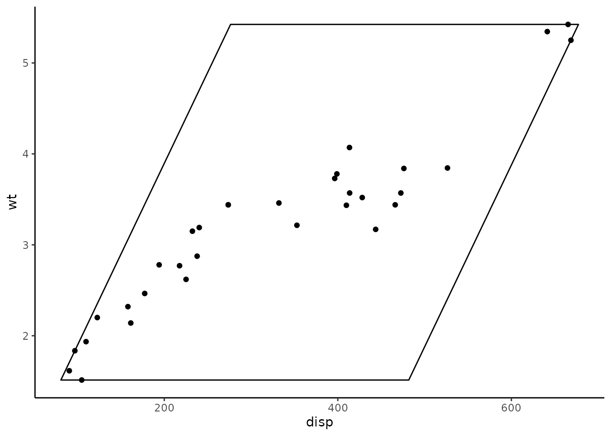

# Transforming coordinate systems

[ggplot2](https://ggplot2.tidyverse.org) has many built-in [coordinate
systems](https://ggplot2-book.org/coord.html) which are used to both 1)
produce the two-dimensional position of the plotted data and 2) draw
custom axes and panel backgrounds.
[`coord_geo()`](https://williamgearty.com/deeptime/reference/coord_geo.md)
uses this second purpose to draw special axes that include timescales.
However, **deeptime** also includes a number of other coordinate systems
whose primary function is to modify the way data is plotted. To
demonstrate this, we’ll first need to load some packages.

``` r
# Load deeptime
library(deeptime)
# Load ggplot for making plots
# It has some example data too
library(ggplot2)
```

## coord_trans meets coord_flip

One limitation of the traditional
[`coord_trans()`](https://ggplot2.tidyverse.org/reference/coord_transform.html)
function in [ggplot2](https://ggplot2.tidyverse.org) is that you can not
flip the axes while also transforming the axes. Historically, you would
need to either 1) use
[`scale_x_continuous()`](https://ggplot2.tidyverse.org/reference/scale_continuous.html)
or
[`scale_y_continuous()`](https://ggplot2.tidyverse.org/reference/scale_continuous.html)
to transform one or both of your axes (which could result in the
untransparent loss of data) in combination with
[`coord_flip()`](https://ggplot2.tidyverse.org/reference/coord_flip.html)
or 2) transform your data before supplying it to
[`ggplot()`](https://ggplot2.tidyverse.org/reference/ggplot.html).
[`coord_trans_flip()`](https://williamgearty.com/deeptime/reference/coord_trans_flip.md)
accomplishes this without the need for `scales` or transforming your
data. It works just like
[`coord_trans()`](https://ggplot2.tidyverse.org/reference/coord_transform.html),
with the added functionality of the axis flip from
[`coord_flip()`](https://ggplot2.tidyverse.org/reference/coord_flip.html).

``` r
ggplot(mtcars, aes(disp, wt)) +
  geom_point() +
  coord_trans_flip(x = "sqrt", y = "log10") +
  theme_classic()
```



Note: back in 2020, [ggplot2](https://ggplot2.tidyverse.org)
[updated](https://tidyverse.org/blog/2020/03/ggplot2-3-3-0/#bi-directional-geoms-and-stats)
all the directional stats and geoms (e.g., boxplots and histograms) to
work in both directions based on the aesthetic mapping. This somewhat
makes this function redundant, but I still find it useful.

## 2D linear transformations

Another limitation of the traditional
[`coord_trans()`](https://ggplot2.tidyverse.org/reference/coord_transform.html)
is that each axis is transformed independently.
[`coord_trans_xy()`](https://williamgearty.com/deeptime/reference/coord_trans_xy.md)
expands this functionality to allow for a two-dimensional linear
transformation as generated by
[`ggforce::linear_trans()`](https://ggforce.data-imaginist.com/reference/linear_trans.html).
This allows for rotations, stretches, shears, translations, and
reflections. A dummy example using the
[`?mtcars`](https://rdrr.io/r/datasets/mtcars.html) dataset from
[ggplot2](https://ggplot2.tidyverse.org) is included below. While
applications of this functionality may seem abstract for real data, see
the [plotting
traits](https://williamgearty.com/deeptime/articles/traits.md) article
for a potential real-world application using species trait data.

``` r
# make transformer
library(ggforce)
trans <- linear_trans(shear(50, 0))

# set up data to be plotted
square <- data.frame(
  disp = c(
    min(mtcars$disp), min(mtcars$disp),
    max(mtcars$disp), max(mtcars$disp)
  ),
  wt = c(
    min(mtcars$wt), max(mtcars$wt),
    max(mtcars$wt), min(mtcars$wt)
  )
)

# plot data normally
library(ggplot2)
ggplot(mtcars, aes(disp, wt)) +
  geom_polygon(data = square, fill = NA, color = "black") +
  geom_point(color = "black") +
  coord_cartesian() +
  theme_classic()
```



``` r
# plot data with transformation
ggplot(mtcars, aes(disp, wt)) +
  geom_polygon(data = square, fill = NA, color = "black") +
  geom_point(color = "black") +
  coord_trans_xy(trans = trans, expand = TRUE) +
  theme_classic()
```


