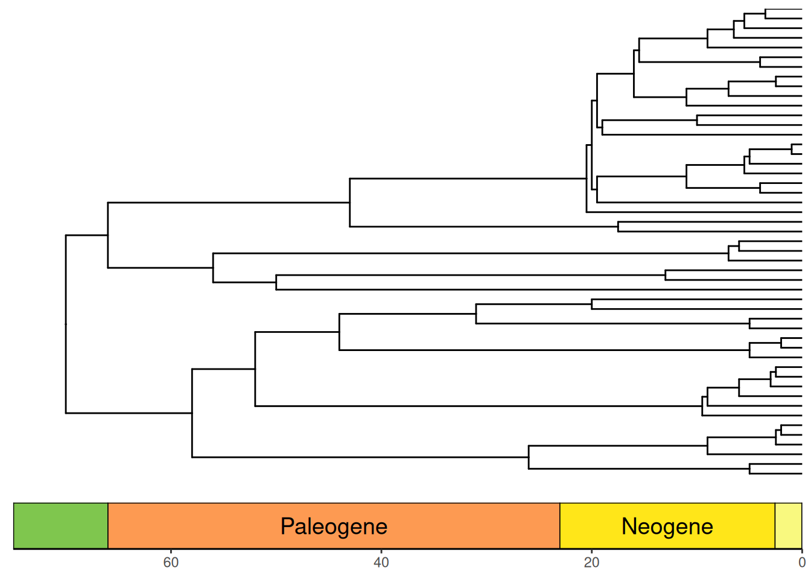
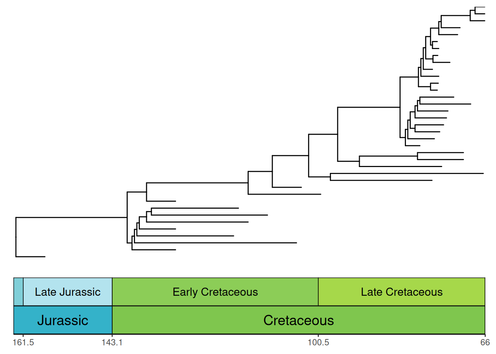

# Adding geological timescales to phylogenies

[`coord_geo()`](https://williamgearty.com/deeptime/reference/coord_geo.md)
is also designed to work smoothly with phylogenies that are plotted with
the [ggtree](https://www.bioconductor.org/packages/ggtree) package.
First let’s load some important packages.

``` r
# Load deeptime
library(deeptime)
# Load other packages
library(ggplot2)
library(dplyr)
# Load ggtree
library(ggtree)
# Load phytools for some example data
library(phytools)
data(mammal.tree)
# Load paleotree for some example fossil data
library(paleotree)
data(RaiaCopesRule)
```

## Timescales and phylogenies

Now, let’s plot some phylogenies with timescales! Note that by default
the time axis increases toward the tips for trees plotted with
[`ggtree()`](https://rdrr.io/pkg/ggtree/man/ggtree.html), so you must
use the [`revts()`](https://rdrr.io/pkg/ggtree/man/revts.html) function
from [ggtree](https://www.bioconductor.org/packages/ggtree) to change
the x-axis values to increasing negative values. Note that once you’ve
done this, you will need to set `neg = TRUE` in
[`coord_geo()`](https://williamgearty.com/deeptime/reference/coord_geo.md).
Furthermore, any time axis limits that you set will need to be negative.
Here we also use the
[`scale_x_continuous()`](https://ggplot2.tidyverse.org/reference/scale_continuous.html)
function to relabel the negative x-axis values with positive labels.

``` r
p <- ggtree(mammal.tree) +
  coord_geo(xlim = c(-75, 0), ylim = c(-2, Ntip(mammal.tree)),
            neg = TRUE, abbrv = FALSE) +
  scale_x_continuous(breaks = seq(-80, 0, 20), labels = abs(seq(-80, 0, 20))) +
  theme_tree2()
revts(p)
## Warning: Unknown or uninitialised column: `subgroup`.
## Unknown or uninitialised column: `subgroup`.
## Unknown or uninitialised column: `subgroup`.
## Unknown or uninitialised column: `subgroup`.
```



### Phylogenies with only fossil taxa

Many phylogenies only have fossil taxa in them (i.e., non-ultrametric).
These can be handled by
[`coord_geo()`](https://williamgearty.com/deeptime/reference/coord_geo.md)
by using
[`position_nudge()`](https://ggplot2.tidyverse.org/reference/position_nudge.html)
function. In most cases, you will want to nudge the time axis values (in
this case, the x-axis) by the `root.time` of your phylogeny. Also, note
that we have modified `plot.margin` here to accommodate the stacked
timescale.

``` r
ggtree(ceratopsianTreeRaia,
       position = position_nudge(x = -ceratopsianTreeRaia$root.time)) +
  coord_geo(
    xlim = c(-163.5, -66), ylim = c(-2, Ntip(ceratopsianTreeRaia)),
    pos = list("bottom", "bottom"), skip = c("Paleocene", "Middle Jurassic"),
    dat = list("epochs", "periods"), abbrv = FALSE,
    size = list(4, 5), neg = TRUE, center_end_labels = TRUE
  ) +
  scale_x_continuous(breaks = -rev(epochs$max_age),
                     labels = rev(epochs$max_age)) +
  theme_tree2() +
  theme(plot.margin = margin(7, 11, 7, 11))
## Warning: Unknown or uninitialised column: `subgroup`.
## Unknown or uninitialised column: `subgroup`.
## Unknown or uninitialised column: `subgroup`.
## Unknown or uninitialised column: `subgroup`.
```



## Circular phylogenies

Phylogenies can be plotted in a circular layout with a timescale
background using the
[`coord_geo_radial()`](https://williamgearty.com/deeptime/reference/coord_geo_radial.md)
function. It works just like
[`coord_geo()`](https://williamgearty.com/deeptime/reference/coord_geo.md)
and has many of the same arguments. You can use the `expand` argument in
[`scale_x_continuous()`](https://ggplot2.tidyverse.org/reference/scale_continuous.html)
to add space at either end of the timescale. You can use the `expand`
argument in
[`scale_y_continuous()`](https://ggplot2.tidyverse.org/reference/scale_continuous.html)
to add space to either side of the phylogeny to prevent the tips from
overlapping with the `pie` edges.

``` r
revts(ggtree(mammal.tree)) +
  coord_geo_radial(dat = "stages") +
  scale_x_continuous(breaks = seq(-60, 0, 20), labels = abs(seq(-60, 0, 20)),
                     expand = expansion(mult = c(0.05, 0))) +
  scale_y_continuous(guide = NULL, expand = expansion(mult = c(0.01, 0.01))) +
  theme_classic()
```


### Circular phylogenies with “stacked” timescales

Timescales can even be “stacked” like with
[`coord_geo()`](https://williamgearty.com/deeptime/reference/coord_geo.md),
although the stacking occurs in a circular fashion. We also use the
`prop`, `start`, `end`, and `direction` arguments to specify how the
different timescales are oriented and split within the polar space.

``` r
revts(ggtree(mammal.tree)) +
  coord_geo_radial(
      dat = list("stages", "periods"), alpha = .5, lty = "dashed",
      prop = list(0.66, .34), start = 2 * pi, end = 1.75 * pi, direction = 1,
  ) +
  scale_x_continuous(breaks = seq(-60, 0, 20), labels = abs(seq(-60, 0, 20)),
                     expand = expansion(mult = c(0.05, 0))) +
  scale_y_continuous(guide = NULL, expand = expansion(mult = c(0.01, 0.01))) +
  theme_classic()
```


### Disclaimer

Note that
[`coord_geo_radial()`](https://williamgearty.com/deeptime/reference/coord_geo_radial.md)
has been tested with the plotting of ultrametric and non-ultrametric
phylogenies with
[`ggtree::ggtree()`](https://rdrr.io/pkg/ggtree/man/ggtree.html), but it
may have unexpected behavior when combined with other functions from
[ggtree](https://www.bioconductor.org/packages/ggtree). Furthermore,
[`coord_geo_radial()`](https://williamgearty.com/deeptime/reference/coord_geo_radial.md)
may be useful (albeit perhaps abstract) for plotting other types of
data, but this has not been investigated.

### Axis timescales on radial phylogenies

[`coord_geo_radial()`](https://williamgearty.com/deeptime/reference/coord_geo_radial.md)
is quite different from
[`coord_geo()`](https://williamgearty.com/deeptime/reference/coord_geo.md).
Instead of adding a timescale to an axis, it adds the timescale to the
entire (or part of the) background of the radial plot. In many cases,
this may be useful. However, if you’re annotating your plot with other
text or shapes, these background colors may be distracting. Perhaps
you’d rather just have the look of
[`coord_geo()`](https://williamgearty.com/deeptime/reference/coord_geo.md)
instead along the radial axis? Look no further than
[`guide_geo()`](https://williamgearty.com/deeptime/reference/guide_geo.md).
By default, ggplot uses
[`guide_axis()`](https://ggplot2.tidyverse.org/reference/guide_axis.html)
to style the radial axis of radial plots. However, we can replace this
with time intervals using the
[`guide_geo()`](https://williamgearty.com/deeptime/reference/guide_geo.md)
function. Here’s a brief example using the same mammal phylogeny from
above:

``` r
revts(ggtree(mammal.tree)) +
  coord_radial(theta = "y", start = -0.5 * pi, end = 1.25 * pi) +
  scale_x_continuous(breaks = seq(-60, 0, 20), labels = abs(seq(-60, 0, 20)),
                     expand = expansion(mult = c(0.05, 0)),
                     guide = guide_geo("epochs", neg = TRUE, rot = -90,
                                       size = "auto",
                                       height = unit(1, "line"))) +
  scale_y_continuous(guide = NULL, expand = expansion(mult = c(0.01, 0.01))) +
  theme_classic()
```


You’ll notice that the tick marks and labels are now missing. This is
because
[`guide_geo()`](https://williamgearty.com/deeptime/reference/guide_geo.md)
only adds the intervals, not the rest of the axis stuff. Don’t worry, we
can add those in too using
[`guide_axis_stack()`](https://ggplot2.tidyverse.org/reference/guide_axis_stack.html)
and
[`guide_axis()`](https://ggplot2.tidyverse.org/reference/guide_axis.html).
In most cases you probably want to set the `spacing` to 0 (i.e.,
`unit(0, "line")`) so the different guides are glued together.

``` r
revts(ggtree(mammal.tree)) +
  coord_radial(theta = "y", start = -0.5 * pi, end = 1.25 * pi) +
  scale_x_continuous(breaks = seq(-60, 0, 20), labels = abs(seq(-60, 0, 20)),
                     expand = expansion(mult = c(0.05, 0)),
                     guide = guide_axis_stack(guide_geo("epochs", neg = TRUE,
                                                        rot = -90, size = "auto",
                                                        height = unit(1, "line")),
                                              guide_axis(),
                                              spacing = unit(0, "line"))) +
  scale_y_continuous(guide = NULL, expand = expansion(mult = c(0.01, 0.01))) +
  theme_classic()
```


There they are! Hmm…after looking at all of these phylogenies with
background colors, this one looks quite bare. Fortunately, we can use
*both*
[`coord_geo_radial()`](https://williamgearty.com/deeptime/reference/coord_geo_radial.md)
and
[`guide_geo()`](https://williamgearty.com/deeptime/reference/guide_geo.md)
to make a phylogeny that really pops! However, since we’re trying to
avoid a distracting background, we’ll set the fill colors to a light
gray scale. We’ll also adjust the `end` value for
[`coord_geo_radial()`](https://williamgearty.com/deeptime/reference/coord_geo_radial.md)
to remove the empty space. Note that if the `start` and `end` values
result in the same polar locations, the axis will be bumped to the
margin, so we use an `end` value that is *just* slightly smaller than
the `start` value. This leaves a very small gap, but it’s covered by the
[`guide_geo()`](https://williamgearty.com/deeptime/reference/guide_geo.md)
boxes. Finally, note that you can use
[`guide_geo()`](https://williamgearty.com/deeptime/reference/guide_geo.md)
within `scale_` functions and also within the
[`guides()`](https://ggplot2.tidyverse.org/reference/guides.html)
function.

``` r
revts(ggtree(mammal.tree)) +
  coord_geo_radial(dat = "stages", fill = c("grey90", "grey95"), end = 1.49 * pi) +
  scale_x_continuous(breaks = seq(-60, 0, 20), labels = abs(seq(-60, 0, 20)),
                     expand = expansion(mult = c(0.05, 0))) +
  scale_y_continuous(guide = NULL, expand = expansion(mult = c(0.01, 0.05))) +
  theme_classic() +
  guides(r = guide_axis_stack(guide_geo("epochs", neg = TRUE,
                                        rot = -90, size = "auto",
                                        height = unit(1, "line")),
                              guide_axis(),
                              spacing = unit(0, "line"))) +
  theme(axis.text.y = element_text(color = "black"))
```


Very cool! Note that
[`guide_geo()`](https://williamgearty.com/deeptime/reference/guide_geo.md)
can actually be used for any plot, but it basically does the same thing
as
[`coord_geo()`](https://williamgearty.com/deeptime/reference/coord_geo.md)
for non-radial plots and generally requires more lines of code.

### Tip labels on radial phylogenies

**deeptime** also provides a specialized geom,
[`geom_text_phylo()`](https://williamgearty.com/deeptime/reference/geom_text_phylo.md),
for adding tip labels to phylogenies plotted with
[`ggtree()`](https://rdrr.io/pkg/ggtree/man/ggtree.html). It works
similarly to
[`ggtree::geom_tiplab()`](https://rdrr.io/pkg/ggtree/man/geom_tiplab.html),
[`ggtree::geom_tiplab2()`](https://rdrr.io/pkg/ggtree/man/geom_tiplab2.html),
[`ggtree::geom_nodelab()`](https://rdrr.io/pkg/ggtree/man/geom_nodelab.html),
and
[`ggtree::geom_nodelab2()`](https://rdrr.io/pkg/ggtree/man/geom_nodelab2.html).
However, unlike those geoms, this geom is intended to work with all
coordinate systems, including
[`coord_geo()`](https://williamgearty.com/deeptime/reference/coord_geo.md),
[`ggplot2::coord_radial()`](https://ggplot2.tidyverse.org/reference/coord_radial.html),
and
[`coord_geo_radial()`](https://williamgearty.com/deeptime/reference/coord_geo_radial.md).
For example, it can automatically adjust the angle and justification of
the text based on its position in the plot. It can also be used to label
only tips or only internal nodes. Here’s a brief example using the same
mammal phylogeny from above. Notice that we use `nudge_x = 2` to move
the labels away from the tips a bit. We also use `plot.margin` to add
some space around the plot so the labels aren’t cut off.

``` r
revts(ggtree(mammal.tree)) +
    geom_text_phylo(nudge_x = 2) +
    coord_geo_radial(dat = "stages", fill = c("grey90", "grey95"), end = 1.49 * pi) +
    scale_x_continuous(breaks = seq(-60, 0, 20), labels = abs(seq(-60, 0, 20)),
                       expand = expansion(mult = c(0.05, 0))) +
    scale_y_continuous(guide = NULL, expand = expansion(mult = c(0.01, 0.05))) +
    theme_classic() +
    guides(r = guide_axis_stack(guide_geo("epochs", neg = TRUE,
                                          rot = -90, size = "auto",
                                          height = unit(1, "line")),
                                guide_axis(),
                                spacing = unit(0, "line"))) +
    theme(axis.text.y = element_text(color = "black"), plot.margin = margin(4,4,4,4, "lines"))
```


[`geom_text_phylo()`](https://williamgearty.com/deeptime/reference/geom_text_phylo.md)
inherits all of the arguments from
[`ggplot2::geom_text()`](https://ggplot2.tidyverse.org/reference/geom_text.html),
so you can modify the text size, color, font, etc. as you would with any
other text geom. You can also use the `angle`, `hjust`, and `vjust`
aesthetics to further customize the text orientation and justification.
