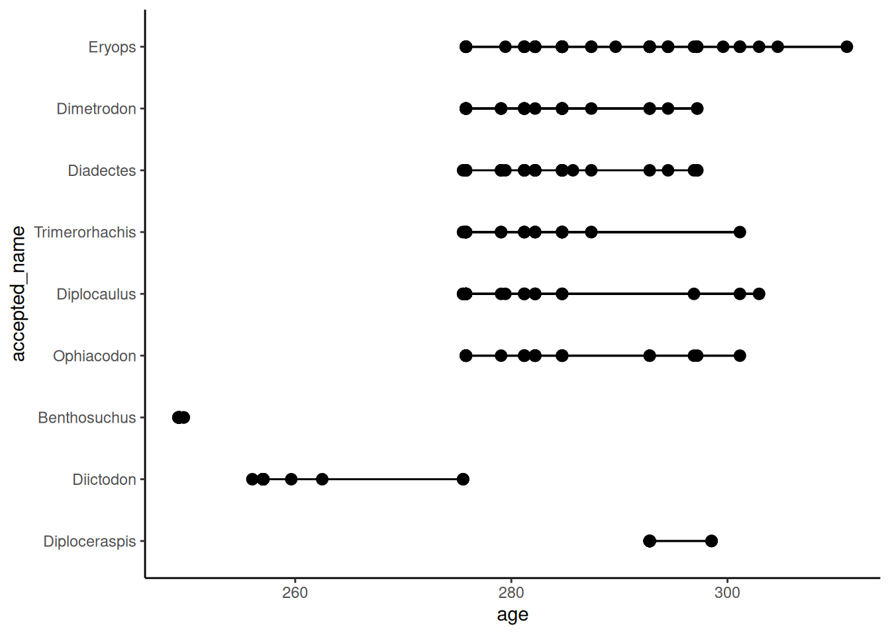
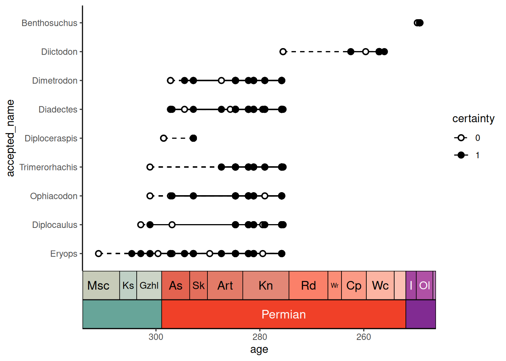
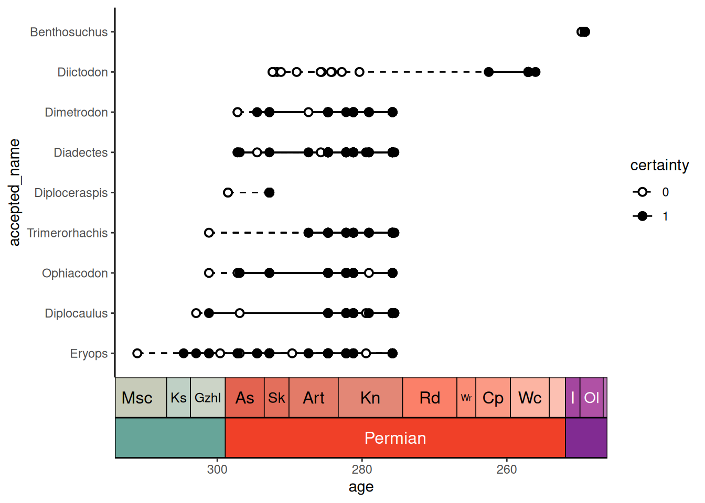
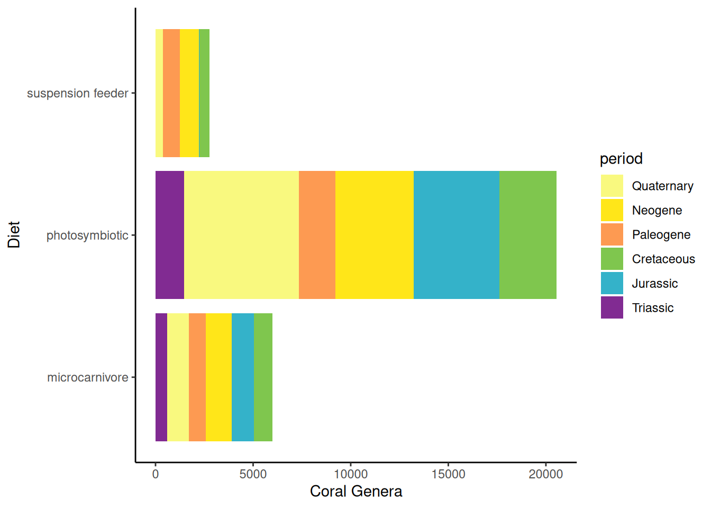
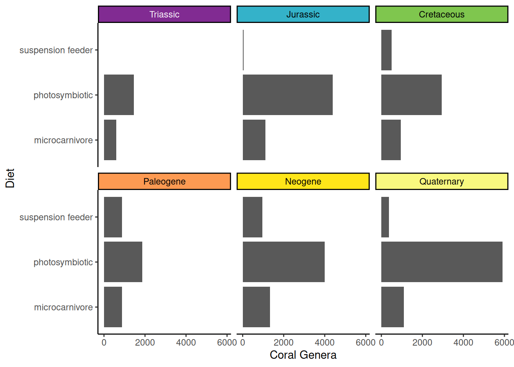
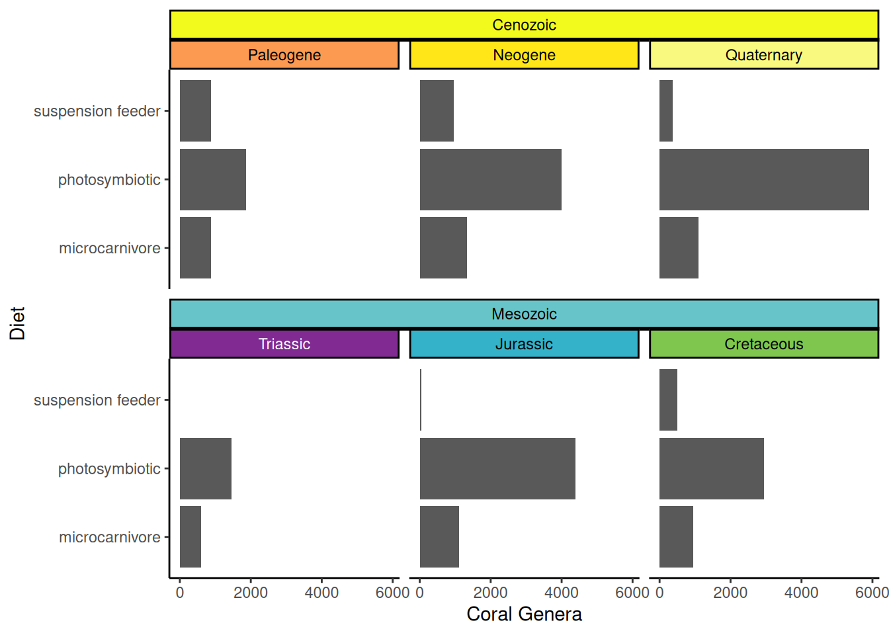

# Plotting temporal data

Many packages exist to visualize temporal data (e.g., geological or
evolutionary biological data). **deeptime** similarly has a few novel
ways to help you plot your temporal data in useful ways. We’ll first
load some packages and example data so we can demonstrate some of this
functionality.

``` r
# Load deeptime
library(deeptime)
# Load other packages
library(ggplot2)
library(dplyr)
# Load palaeoverse for tetrapod occurrence data
library(palaeoverse)
data(tetrapods)
```

## Plot occurrences through time

Do you have a bunch of temporal occurrences of taxa or some sort of
geological phenomenon, but you don’t want to go through all of the pain
of figuring out how to visualize those occurrences and their temporal
ranges? And it needs to be customizable and have a pretty geological or
stratigraphic timescale on the side? Well, then
[`geom_points_range()`](https://williamgearty.com/deeptime/reference/geom_points_range.md)
is your friend!

[`geom_points_range()`](https://williamgearty.com/deeptime/reference/geom_points_range.md)
is like
[`ggplot2::geom_pointrange()`](https://ggplot2.tidyverse.org/reference/geom_linerange.html)
in that it plots points and their ranges. However, the “raw” data that
goes into
[`ggplot2::geom_pointrange()`](https://ggplot2.tidyverse.org/reference/geom_linerange.html)
is the lower, upper, and the coordinates for an individual point for
each group. First, we’re too lazy to calculate our own ranges! Second,
only one point per group? But we have a whole bunch of occurrences for
each group that need to be plotted! The difference with
[`geom_points_range()`](https://williamgearty.com/deeptime/reference/geom_points_range.md)
is that the raw data it takes in is all of your grouped temporal data.
It then does all of the work for you to plot those individual
occurrences AND the ranges of those occurrences for each group. Let’s
try it out with some Permian vertebrate occurrence data from the
`palaeoverse`:

``` r
# sort the occurrences from most common genera to least common genera
# assume the age is just the mean of the max and min
occdf <- tetrapods %>%
  filter(accepted_rank == "genus") %>%
  select(occurrence_no, accepted_name, max_ma, min_ma) %>%
  mutate(accepted_name = reorder(accepted_name, accepted_name, length)) %>%
  arrange(desc(accepted_name)) %>%
  mutate(age = (max_ma + min_ma) / 2)
# get a reasonable subset of those occurrences
occdf <- occdf[1:300, ]

# plot those occurrences
ggplot(data = occdf) +
  geom_points_range(aes(x = age, y = accepted_name)) +
  theme_classic()
```



And then, of course, we want to add a timescale:

``` r
ggplot(data = occdf) +
  geom_points_range(aes(x = age, y = accepted_name)) +
  scale_x_reverse() +
  coord_geo(pos = list("bottom", "bottom"), dat = list("stages", "periods"),
            abbrv = list(TRUE, FALSE), expand = TRUE, size = "auto") +
  theme_classic()
```


What if we aren’t certain about some of our data points? Maybe we don’t
necessarily know if they are assigned to the correct genus or perhaps we
are uncertain about their age? Fortunately, we have all of the tools of
ggplot available to us! First we’ll simulate some binary “certainty”
values, then we’ll plot certainty as additional aesthetics:

``` r
occdf$certainty <- factor(sample(0:1, nrow(occdf), replace = TRUE))

ggplot(data = occdf) +
  geom_points_range(aes(x = age, y = accepted_name,
                        fill = certainty, linetype = certainty), shape = 21) +
  scale_x_reverse() +
  scale_fill_manual(values = c("white", "black")) +
  scale_linetype_manual(values = c("dashed", "solid")) +
  coord_geo(pos = list("bottom", "bottom"), dat = list("stages", "periods"),
            abbrv = list(TRUE, FALSE), expand = TRUE, size = "auto") +
  theme_classic()
```


Finally, we can sort the taxa so that they are arranged in order of
their earliest occurrence:

``` r
occdf$accepted_name <- reorder(occdf$accepted_name, occdf$age, max,
                               decreasing = TRUE)
ggplot(data = occdf) +
  geom_points_range(aes(x = age, y = accepted_name,
                        fill = certainty, linetype = certainty), shape = 21) +
  scale_x_reverse() +
  scale_fill_manual(values = c("white", "black")) +
  scale_linetype_manual(values = c("dashed", "solid")) +
  coord_geo(pos = list("bottom", "bottom"), dat = list("stages", "periods"),
            abbrv = list(TRUE, FALSE), expand = TRUE, size = "auto") +
  theme_classic()
```



Note that our uncertain lines (0) always overlap with our certain lines
(1), so there is a continuous line spanning each taxon’s entire range.
However, if we tweak some of the data, we can change that, causing a gap
in the ranges. Note that in this engineered example, the uncertain and
certain ranges for *Diictodon* no longer overlap, so there is a gap
between them:

``` r
oldest_certain <- occdf %>%
  filter(accepted_name == "Diictodon", certainty == 1) %>%
  pull(age) %>%
  max()

n_uncertain <- sum(occdf$accepted_name == "Diictodon" & occdf$certainty == 0)

# make the uncertain points all much older
occdf$age[occdf$accepted_name == "Diictodon" & occdf$certainty == 0] <-
  oldest_certain + runif(n_uncertain, 15, 30)

ggplot(data = occdf) +
  geom_points_range(aes(x = age, y = accepted_name,
                        fill = certainty, linetype = certainty), shape = 21) +
  scale_x_reverse() +
  scale_fill_manual(values = c("white", "black")) +
  scale_linetype_manual(values = c("dashed", "solid")) +
  coord_geo(pos = list("bottom", "bottom"), dat = list("stages", "periods"),
            abbrv = list(TRUE, FALSE), expand = TRUE, size = "auto") +
  theme_classic()
```


However, if we want a line connecting these groups of points, we can fix
this by using the `background_line` argument, which can be a list of
aesthetic values to use for the background line segments:

``` r
ggplot(data = occdf) +
  geom_points_range(aes(x = age, y = accepted_name,
                        fill = certainty, linetype = certainty), shape = 21,
                    background_line = list(linetype = "dashed")) +
  scale_x_reverse() +
  scale_fill_manual(values = c("white", "black")) +
  scale_linetype_manual(values = c("dashed", "solid")) +
  coord_geo(pos = list("bottom", "bottom"), dat = list("stages", "periods"),
            abbrv = list(TRUE, FALSE), expand = TRUE, size = "auto") +
  theme_classic()
```



Finally, while I’ve showcased this geom with the use case of plotting
occurrence data, note that the potential usage for this function is much
broader. Basically any set of data with a categorical and a continuous
variable could be visualized like this (when appropriate).

## Geological timescale color scales for ggplot

You may also want to color your data based on its age. **deeptime** has
[`scale_color_geo()`](https://williamgearty.com/deeptime/reference/scale_geo.md)
and
[`scale_fill_geo()`](https://williamgearty.com/deeptime/reference/scale_geo.md)
for this very purpose! Note that currently these scales only work with
discrete data. The default behavior is for the color/fill aesthetic
values to match the names of the intervals in `dat`. Here, we’ll use the
coral_div_dis data from the first vignette tutorial:

``` r
ggplot(coral_div_dis, aes(x = n, y = diet, fill = period)) +
  geom_col() +
  scale_fill_geo(periods) +
  xlab("Coral Genera") +
  ylab("Diet") +
  theme_classic()
```



## Facetting with the geological timescale

Another way to split data by categories is by
[faceting](https://ggplot2-book.org/facet.html). **deeptime** has a
suite of facetting functions that allow you to facet by geological
intervals
([`facet_grid_geo()`](https://williamgearty.com/deeptime/reference/facet_grid_color.md),
[`facet_wrap_geo()`](https://williamgearty.com/deeptime/reference/facet_wrap_color.md),
[`facet_nested_geo()`](https://williamgearty.com/deeptime/reference/facet_nested_color.md),
and
[`facet_nested_wrap_geo()`](https://williamgearty.com/deeptime/reference/facet_nested_wrap_color.md)).
Here, we’ll use the same coral diversity data as above, but facet wrap
it by period. Note that we need to convert the `period` column to an
ordered factor so the facets appear in chronological order.

``` r
coral_div_dis <- coral_div_dis %>%
  mutate(period = factor(period, levels = rev(periods$name)))


ggplot(coral_div_dis, aes(x = n, y = diet)) +
  geom_col() +
  scale_fill_geo(periods) +
  xlab("Coral Genera") +
  ylab("Diet") +
  theme_classic() +
  facet_wrap_geo(~period, colors = periods)
```



Just like with adding timescales to plots, you may want to show
hierarchical timescale information. For example, we may want to show
which of these periods are in the Mesozoic and which are in the
Cenozoic. We can do this by adding a new column to our data that
indicates the era of each period, then using both the period and era
columns to make a nested facet:

``` r
coral_div_dis <- coral_div_dis %>%
  mutate(era = ifelse(period %in% c("Paleogene", "Neogene", "Quaternary"),
                      "Cenozoic", "Mesozoic")) %>%
  mutate(era = factor(era, levels = c("Cenozoic", "Mesozoic")))

ggplot(coral_div_dis, aes(x = n, y = diet)) +
  geom_col() +
  scale_fill_geo(periods) +
  xlab("Coral Genera") +
  ylab("Diet") +
  theme_classic() +
  facet_nested_wrap_geo(~era + period, colors = rbind(periods, eras), nrow = 2)
```


