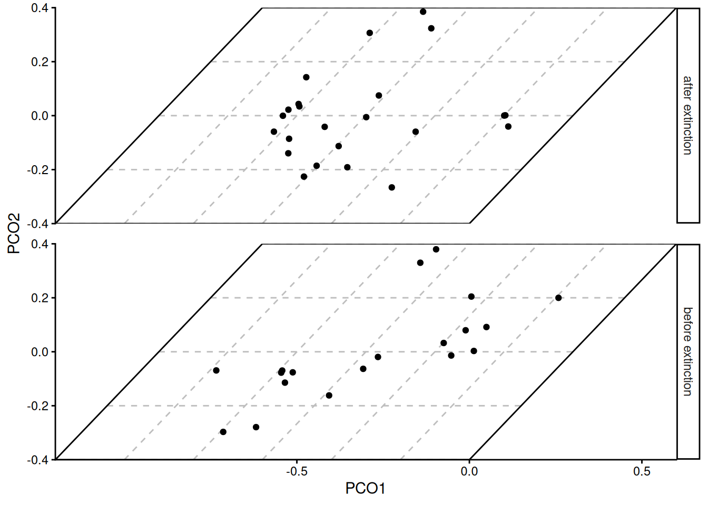
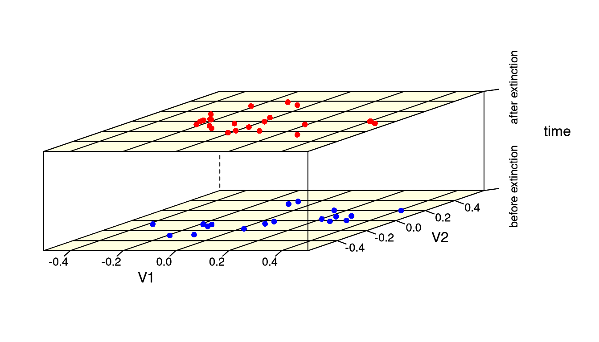
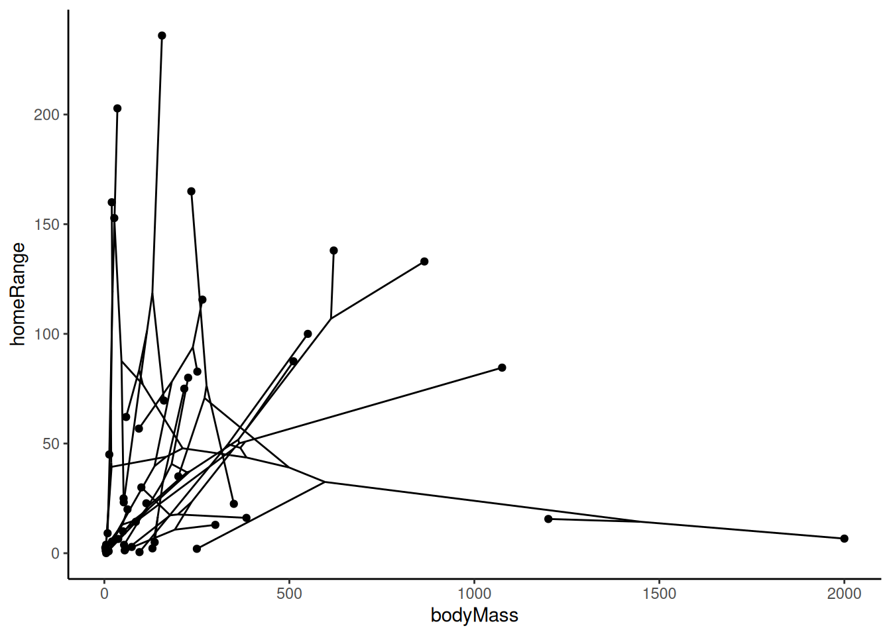

# Plotting trait data

Many packages exist to visualize trait data for biological species.
**deeptime** similarly has a few novel ways to help you plot your data
in useful ways. We’ll first load some packages and example data so we
can demonstrate some of this functionality.

``` r
# Load deeptime
library(deeptime)
# Load other packages
library(ggplot2)
library(dplyr)
# Load dispRity for example data
library(dispRity)
data(demo_data)
# Load paleotree for example data
library(phytools)
data(mammal.tree)
data(mammal.data)
```

## Plot disparity through time

A common way to visualize trait data, especially for fossil species, is
to show the two-dimensional trait distribution for several time
intervals. This allows the viewer to easily compare the trait
distribution through time. However, producing such a plot has
historically been very time intensive, often involving the use of custom
code and image editing software (e.g.,
[Inkscape](https://inkscape.org/)). While a single function to
accomplish such a visualization still does not exist for
[ggplot2](https://ggplot2.tidyverse.org) (yet…), the
[`coord_trans_xy()`](https://williamgearty.com/deeptime/reference/coord_trans_xy.md)
function can be used to generate a similar plot with sheared trait space
across several time intervals.

``` r
# make transformer
library(ggforce)
trans <- linear_trans(shear(.75, 0))

# prepare data to be plotted
crinoids <- as.data.frame(demo_data$wright$matrix[[1]][, 1:2])
crinoids$time <- "before extinction"
crinoids$time[demo_data$wright$subsets$after$elements] <- "after extinction"

# a box to outline the trait space
square <- data.frame(V1 = c(-.6, -.6, .6, .6), V2 = c(-.4, .4, .4, -.4))

ggplot() +
  geom_segment(
    data = data.frame(
      x = -.6, y = seq(-.4, .4, .2),
      xend = .6, yend = seq(-0.4, .4, .2)
    ),
    aes(x = x, y = y, xend = xend, yend = yend),
    linetype = "dashed", color = "grey"
  ) +
  geom_segment(
    data = data.frame(
      x = seq(-.6, .6, .2), y = -.4,
      xend = seq(-.6, .6, .2), yend = .4
    ),
    aes(x = x, y = y, xend = xend, yend = yend),
    linetype = "dashed", color = "grey"
  ) +
  geom_polygon(data = square, aes(x = V1, y = V2), fill = NA, color = "black") +
  geom_point(data = crinoids, aes(x = V1, y = V2), color = "black") +
  coord_trans_xy(trans = trans, expand = FALSE) +
  labs(x = "PCO1", y = "PCO2") +
  theme_classic() +
  facet_wrap(~time, ncol = 1, strip.position = "right") +
  theme(panel.spacing = unit(1, "lines"), panel.background = element_blank())
```



### Disparity in base R

The
[`disparity_through_time()`](https://williamgearty.com/deeptime/reference/disparity_through_time.md)
function accomplishes nearly all of the work for you if you are
comfortable plotting within the
[lattice](https://lattice.r-forge.r-project.org/) framework (base R).
Note that it may take some tweaking (especially the `aspect` argument)
to get the results to look the way you want.

``` r
crinoids$time <- factor(crinoids$time)
disparity_through_time(time ~ V2 * V1,
  data = crinoids, groups = time, aspect = c(1.5, .6),
  xlim = c(-.6, .6), ylim = c(-.5, .5),
  col.regions = "lightyellow", col.point = c("red", "blue"),
  par.settings = list(
    axis.line = list(col = "transparent"),
    layout.heights =
      list(
        top.padding = -20, main.key.padding = 0,
        key.axis.padding = 0, axis.xlab.padding = 0,
        xlab.key.padding = 0, key.sub.padding = 0,
        bottom.padding = -20
      ),
    layout.widths =
      list(
        left.padding = -10, key.ylab.padding = 0,
        ylab.axis.padding = 0, axis.key.padding = 0,
        right.padding = 0
      )
  )
)
```



## Phylomorphospaces

Often, trait data will be accompanied with a phylogeny. You may want to
visualize both your phylogeny, the traits of your species, and the
evolution of the trait along your phylogeny. To accomplish this, you can
create a two-dimensional phylomorphospace. The
[phytools](https://github.com/liamrevell/phytools) package has the
[`phytools::phylomorphospace()`](https://rdrr.io/pkg/phytools/man/phylomorphospace.html)
function for accomplishing this in base R. The
[`geom_phylomorpho()`](https://williamgearty.com/deeptime/reference/geom_phylomorpho.md)
function in **deeptime** will help you accomplish this with
[`ggplot()`](https://ggplot2.tidyverse.org/reference/ggplot.html). Note
that labels can be added using
[`geom_label()`](https://ggplot2.tidyverse.org/reference/geom_text.html)
or
[`ggrepel::geom_label_repel()`](https://ggrepel.slowkow.com/reference/geom_text_repel.html),
but they are not demonstrated here because they would obscure the
phylogenetic relationships.

``` r
mammal.data$label <- rownames(mammal.data)

ggplot(mammal.data, aes(x = bodyMass, y = homeRange, label = label)) +
  geom_phylomorpho(mammal.tree) +
  theme_classic()
```


