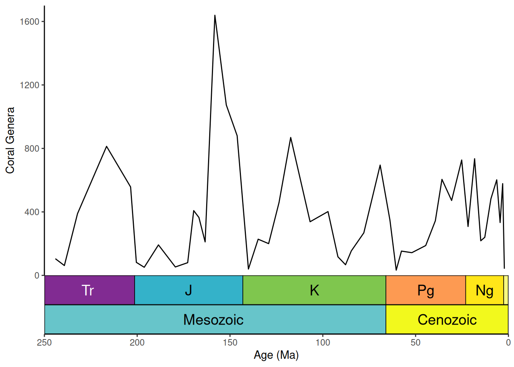
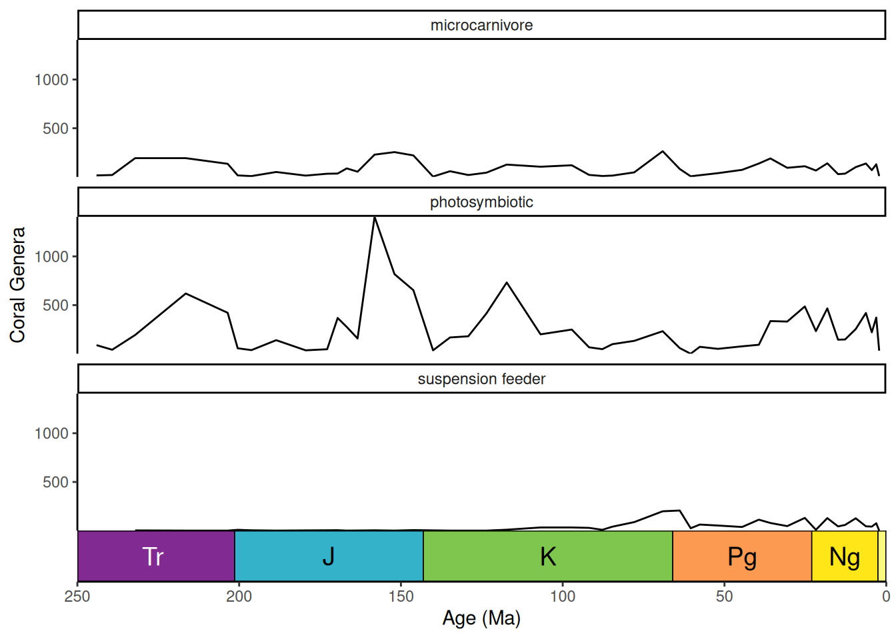
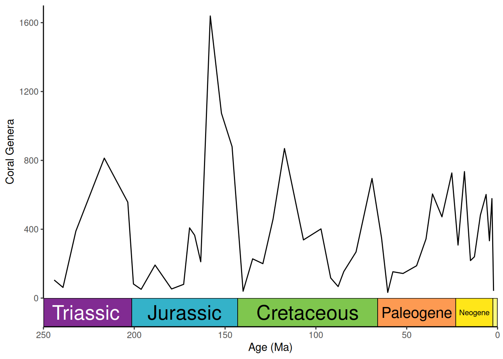

# Adding geological timescales to plots

The main function of **deeptime** is
[`coord_geo()`](https://williamgearty.com/deeptime/dev/reference/coord_geo.md),
which functions just like
[`coord_trans()`](https://ggplot2.tidyverse.org/reference/coord_transform.html)
from [ggplot2](https://ggplot2.tidyverse.org). You can use this function
to add highly customizable timescales to a wide variety of ggplots.
Before we begin, let’s load some necessary packages first.

``` r
# Load deeptime
library(deeptime)
# Load other packages
library(ggplot2)
library(dplyr)
# Load divDyn for coral data
library(divDyn)
data(corals)
# Load gsloid for oxygen isotope data
library(gsloid)
```

## Adding geological timescales

First, let’s summarize some coral data from the `divDyn` package to
generate a diversity curve that we’ll be able to plot:

``` r
# this is not a proper diversity curve but it gets the point across
coral_div <- corals %>%
  filter(stage != "") %>%
  group_by(period, stage) %>%
  summarise(n = n()) %>%
  mutate(stage_age = (stages$max_age[match(stage, stages$name)] +
    stages$min_age[match(stage, stages$name)]) / 2)
```

Now, we can plot the data and add a geological timescale. The default
behavior is to add the ICS periods to the bottom axis. The data used for
this is included in the package
([`?periods`](https://williamgearty.com/deeptime/dev/reference/periods.md))
along with data for
[`?eons`](https://williamgearty.com/deeptime/dev/reference/eons.md),
[`?stages`](https://williamgearty.com/deeptime/dev/reference/stages.md),
[`?epochs`](https://williamgearty.com/deeptime/dev/reference/epochs.md),
and [`?eras`](https://williamgearty.com/deeptime/dev/reference/eras.md).
Note that the function assumes that age is decreasing towards the
present.

``` r
ggplot(coral_div) +
  geom_line(aes(x = stage_age, y = n)) +
  scale_x_reverse("Age (Ma)") +
  ylab("Coral Genera") +
  coord_geo(xlim = c(250, 0), ylim = c(0, 1700)) +
  theme_classic()
```


### Scales on other axes

You can add the timescale to whichever axis you’d like by setting the
`pos` argument. For example, `pos = "left"` can be used to put the
timescale on the left axis. Also, note that we’re using the “Geomagnetic
Polarity Chron” timescale here. This is one of more than 35 regional and
global timescales that are available through **deeptime** from the
[Macrostrat](https://macrostrat.org/api/defs/timescales?all) database
(see
[`get_scale_data()`](https://williamgearty.com/deeptime/dev/reference/get_scale_data.md)).

``` r
ggplot(lisiecki2005) +
  geom_line(aes(x = d18O, y = Time / 1000), orientation = "y") +
  scale_y_reverse("Time (Ma)") +
  scale_x_reverse() +
  coord_geo(
    dat = "Geomagnetic Polarity Chron", xlim = c(6, 2), ylim = c(6, 0),
    pos = "left", rot = 90
  ) +
  theme_classic()
```


### Add multiple timescales

You can also add multiple timescales by providing a list for `pos`.
Other arguments can be lists or single values (either of which will be
recycled if necessary). In this case we are adding the “Geomagnetic
Polarity Chron” timescale to the left axis and the “Planktic
foraminiferal Primary Biozones” timescale to the right axis.

``` r
# uses the oxygen isotope data from above
ggplot(lisiecki2005) +
  geom_line(aes(x = d18O, y = Time / 1000), orientation = "y") +
  scale_y_reverse("Time (Ma)") +
  scale_x_reverse() +
  coord_geo(
    dat = list("Geomagnetic Polarity Chron", "Planktic foraminiferal Primary Biozones"),
    xlim = c(6, 2), ylim = c(5.5, 0), pos = list("l", "r"),
    rot = 90, skip = "PL4", size = list(5, 4)
  ) +
  theme_classic()
```


### Stack multiple scales

You can even stack multiple timescales on the same side. Scales are
added from the inside to the outside. Here we are stacking periods and
eras.

``` r
# uses the coral diversity data from above
ggplot(coral_div) +
  geom_line(aes(x = stage_age, y = n)) +
  scale_x_reverse("Age (Ma)") +
  ylab("Coral Genera") +
  coord_geo(
    dat = list("periods", "eras"), xlim = c(250, 0), ylim = c(0, 1700),
    pos = list("b", "b"), abbrv = list(TRUE, FALSE)
  ) +
  theme_classic()
```



### Timescales and faceted plots

[`coord_geo()`](https://williamgearty.com/deeptime/dev/reference/coord_geo.md)
synergizes well with faceted plots. You can change on which facets the
timescale is plotted by changing the `scales` argument in
[`facet_wrap()`](https://ggplot2.tidyverse.org/reference/facet_wrap.html).
The default behavior is to only include the timescale on the bottom-most
panel. This behavior works similarly with
[`facet_grid()`](https://ggplot2.tidyverse.org/reference/facet_grid.html).

``` r
# uses the coral occurrence data from above
coral_div_diet <- corals %>%
  filter(stage != "") %>%
  group_by(diet, stage) %>%
  summarise(n = n()) %>%
  mutate(stage_age = (stages$max_age[match(stage, stages$name)] +
    stages$min_age[match(stage, stages$name)]) / 2)

ggplot(coral_div_diet) +
  geom_line(aes(x = stage_age, y = n)) +
  scale_x_reverse("Age (Ma)") +
  ylab("Coral Genera") +
  coord_geo(xlim = c(250, 0)) +
  theme_classic() +
  facet_wrap(~diet, nrow = 3)
```



By specifying `scales = "free_x"`, you can add a geological time scale
to each panel.

``` r
ggplot(coral_div_diet) +
  geom_line(aes(x = stage_age, y = n)) +
  scale_x_reverse("Age (Ma)") +
  ylab("Coral Genera") +
  coord_geo(xlim = c(250, 0)) +
  theme_classic() +
  facet_wrap(~diet, nrow = 3, scales = "free_x")
```


### Resize labels to fit inside interval rectangles

[`coord_geo()`](https://williamgearty.com/deeptime/dev/reference/coord_geo.md)
can use the [ggfittext](https://wilkox.org/ggfittext/) package to resize
the interval labels. This can be enabled by setting `size` to `"auto"`.
Additional arguments can be passed to
[`ggfittext::geom_fit_text()`](https://wilkox.org/ggfittext/reference/geom_fit_text.html)
as a list using the `fittext_args` argument.

``` r
ggplot(coral_div) +
  geom_line(aes(x = stage_age, y = n)) +
  scale_x_reverse("Age (Ma)") +
  ylab("Coral Genera") +
  coord_geo(
    dat = "periods", xlim = c(250, 0), ylim = c(0, 1700),
    abbrv = FALSE, size = "auto", fittext_args = list(size = 20)
  ) +
  theme_classic()
```



## Scales on discrete axes

[`coord_geo()`](https://williamgearty.com/deeptime/dev/reference/coord_geo.md)
will automatically detect if your axis is discrete. The categories of
the discrete axis (which can be reordered using the `limits` argument of
[`scale_x_discrete()`](https://ggplot2.tidyverse.org/reference/scale_discrete.html)/[`scale_y_discrete()`](https://ggplot2.tidyverse.org/reference/scale_discrete.html))
should match the `name` column of the timescale data (`dat`). You can
use the arguments of
[`theme()`](https://ggplot2.tidyverse.org/reference/theme.html) and
`scale_[x/y]_discrete()` to optionally remove the labels and tick marks.

``` r
# use the coral occurrence data from above
coral_div_dis <- corals %>%
  filter(period != "") %>%
  group_by(diet, period) %>%
  summarise(n = n()) %>%
  mutate(period_age = (periods$max_age[match(period, periods$name)] +
    periods$min_age[match(period, periods$name)]) / 2) %>%
  arrange(-period_age)

ggplot(coral_div_dis) +
  geom_col(aes(x = period, y = n, fill = diet)) +
  scale_x_discrete("Period",
    limits = unique(coral_div_dis$period), labels = NULL,
    expand = expansion(add = .5)
  ) +
  scale_y_continuous(expand = c(0, 0)) +
  scale_fill_viridis_d("Diet") +
  ylab("Coral Genera") +
  coord_geo(expand = TRUE, skip = NULL, abbrv = TRUE) +
  theme_classic() +
  theme(axis.ticks.length.x = unit(0, "lines"))
```


### Custom discrete scales

You can also supply your own pre-discretized scale data by setting the
`dat_is_discrete` parameter to `TRUE`. Custom scales should always have
`name`, `max_age`, and `min_age` columns. Optional columns include
`abbr` for abbreviations, `color` for background colors, and `lab_color`
for interval label colors. You can even have one scale with
auto-discretized intervals and one scale with pre-discretized intervals.

``` r
eras_custom <- data.frame(
  name = c("Mesozoic", "Cenozoic"), max_age = c(0.5, 3.5),
  min_age = c(3.5, 6.5), color = c("#67C5CA", "#F2F91D")
)

ggplot(coral_div_dis) +
  geom_col(aes(x = period, y = n, fill = diet)) +
  scale_x_discrete(NULL,
    limits = unique(coral_div_dis$period), labels = NULL,
    expand = expansion(add = .5)
  ) +
  scale_y_continuous(expand = c(0, 0)) +
  scale_fill_viridis_d("Diet") +
  ylab("Coral Genera") +
  coord_geo(
    dat = list("periods", eras_custom), pos = c("b", "b"), expand = TRUE,
    skip = NULL, abbrv = list(TRUE, FALSE), dat_is_discrete = list(FALSE, TRUE)
  ) +
  theme_classic() +
  theme(axis.ticks.length.x = unit(0, "lines"))
```


## More advanced topics

Looking to learn about more advanced features of **deeptime**? Look no
further:

- [Plotting phylogenies with
  timescales](https://williamgearty.com/deeptime/dev/articles/phylogenies.md)
- [Additional ggplot coordinate
  systems](https://williamgearty.com/deeptime/dev/articles/coord.md)
- [Plotting trait
  data](https://williamgearty.com/deeptime/dev/articles/traits.md)
- [Plotting temporal
  data](https://williamgearty.com/deeptime/dev/articles/time.md)
- [Plotting geological/stratigraphical
  patterns](https://williamgearty.com/deeptime/dev/articles/time.md)
- [Combining and arranging
  plots](https://williamgearty.com/deeptime/dev/articles/ggarrange2.md)
